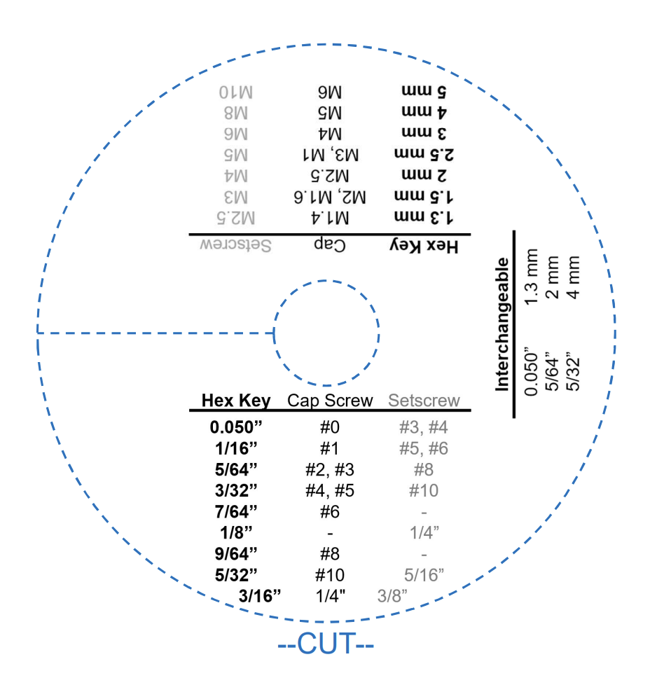
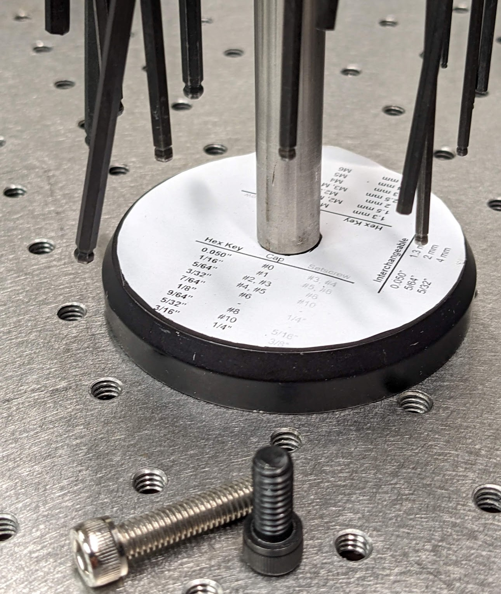

# 5/64ths, M2.5, ... oy vey
After many years guessing hex key size for screws (and more often than not being wrong!) I made this set of charts which can be printed out and pasted on the base of a typical Thorlabs hex key stand ([TC2](https://www.thorlabs.com/thorproduct.cfm?partnumber=TC2) or [TC3/M](https://www.thorlabs.com/thorproduct.cfm?partnumber=TC3/M)).

 
